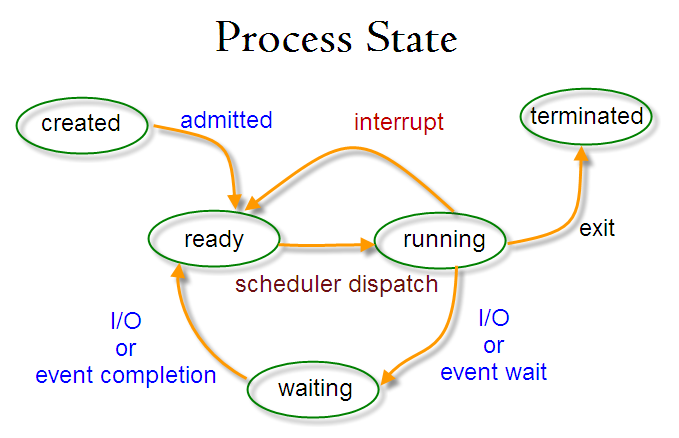

# linux_comandos 
## Lista de comandos básicos do Linux

## Navegue pelo Índice: :penguin:
<a name="links"></a>

* [Comando Linux para perdir ajuda](#link-a)
* [Comandos Linux para Processos](#link1)
* [Conteúdo de Arquivos](#link-c)
* [Adicionar ou remover diretórios](#link-b)
* [Pesquisar dentro de um arquivo](#link2)
* [Traduzir ou deletar caracteres](#link-tr)  
* [Cortar caracteres](#link-cut)
* [Comparar Arquivos](#link-dff)
* [Gerenciar dinamicamente situação dos processos](#link3)
* [Gerenciar execução dos programas no terminal](#link4)
* [Permissões e execução de scripts](#link5)
* [Navegando entre diretórios](#link6)
* [Procurar por arquivos ou diretórios](#link7)
* [Alterar senhas e logar com outro usuário](#link8)
* [Variáveis de ambiente e PATH](#link9)
* [Contando caracteres, palarvras de um arquivo e processos em execução](#link10)
* [Instalação de Programa, gerenciador *apt*](#link11)
* [Utilizando o `dpkg` para instalar ou remover programas](#link12)
* [Script de *init* e *service*](#link13)  
* [Permissões](#link14)
* [Boot e Reboots](#linkboot)

***  

## Questões importantes

__O que é o Shell?__  

Hardware 🎰 <--> Kernel 🐧 <--> Shell 🐚 <-->  User 🙂  

O Shell é o interpretador de comandos do Linux. Quem da entrada com os comandaos (como os listados abaixo) é o usuário. Temos alguns tipos de Shell. Por exemplo: Bash, ZSH, KSH.  

O Shell precisa se comunicar com o Kernel(Linux), este é responsável por fazer a comunicação com o Hardware. No Linux, o Kernel recebe módulos de acordo com as característica do Sistema Operacional. Por exemplo, se quero instalar uma placa de víde ou de som, preciso instalar um módulo no Kernel. Se assemelha às instalações de Drivers no Windows.   

O Shell se comunica com o Kernel, o Kernel conversa com o hardware. O Shell é a interface entre 'nós' e o Kernel + o Hardware.   


***  
<a id="link-a"></a>
### Comando Linux para perdir ajuda  

*  `man` < nome_comando>  
ex:  
`mkdir man`    

* Entender o que significa o comando que você está digitando:    
`whatis <comando>`  
ex: 
`whatis pwd`

* Informações gerais sobre sua máquina(sistema operacional, versão do kernel, processador, nome da máquina, etc):  
`hostnamectl`  
A saída será como o exemplo abaixo:   

```
Static hostname: name-Aspire-A315-54  
         Icon name: computer-laptop    
           Chassis: laptop
        Machine ID: b751fc0a63a341b9a6***eeaec5e26e5  
           Boot ID: 530d77cfa04e4185be***f17f4848ed5  
  Operating System: Ubuntu 20.04.2 LTS  
            Kernel: Linux 5.8.0-53-generic  
      Architecture: x86-64  
```  
* Ao realizar o boot do sistema, são geradas mensagens durante esse processo. Para consultarmos para, por exemplo, ver se há erro na inicialização, podemos digitar:  

`dmesg`  

__Informações dos hardwares e módulos do kernel__  

`lspci -v` Lista informações sobre os hardwares da máquina. 

`lspci -k` LIsta informações sobre módulos do kernel   

`lspci -mm` Lista informações sobre parseadas, mais fácil de serem coletadas.

<a id="link-b"></a>

###  Comando para criar e remover diretório
* Criar:  `mkdir novo_diretorio`  
* Remover: `rm novo_diretorio`  
* Remover sem mensagem de erro:  `rm -f  novo_diretório`  
* Remover diretorio vazio:  `rmdir novo_diretorio` 
 
<a id="link1"></a>

### Comandos Linux para Processos  
  

* `top` Este comando exibem um sumário com detalhes sobre os processos em execução.  

Ele exibe o `PID` do processo que pode ser capaturado para ser verificado em específico ou para ser 'morto'.  
Oferece um resumo de utilizaação e diponibilidade de hardware.
Exibe os porcessos zumbis `Z`, programas inutilizados, mas que consomem recursos.   


* `htop`  Exibe uma lista de processos detalhados e com recursos visuais mais amigáveis.  Precisa ser instalado.

#### Outro comando para processos é o `ps`.

O processo `PID 1` é o primeiro processo que foi startado na máquina. Ele será a saída do comando `ps aux` ou `ps ef`.  


* `ps -e` Listar todos os procesos em execução. Seria "ps" de process?

* `ps -ef` Listar de maneira detalhada todos os processos, o seu PID, quando foi startado, quanto tempo está up.

* `ps -ef | grep <nome do processo a ser filtrado>`  Pesquisar o processo específico. O grep direciona a saída do comando e filtra por um termo desejado

* `ps axu`  Também retorna detalhadamente as informações dos processos executados.   
* `ps auxwww` É listado a linha inteira do processo  

 #### O /proc  

Existe um diretório onde estão os arquivos dos processos: `cd /proc`. nele temos diretórios de todos os processos e são gerados durante conforme o uso da sistema operacional. É um diretório virtual, ele é apagado ao desligarmos o computador e criado quando ligamos  
O `/proc`, possui informações dinâmicas sobre os processos.   

Temos também informações sobre cpu e memória. Dentro do diretório /proc, exemplo: `cat memoinfo`. A saída são informações sobre a memória.

* `ps axo stat,ppid,pid,comm | grep -w defunct`  Identificar processos zumbis e mortos. 

* `Kill <id do processo>` - Interrompe a execução do processo

* `kill -9 <id do processo>` - Interrompe o processo abruptamente    


### Verificar tamanho dos diretórios:  

* `sudo du -sh *` - Retornará um listagem com o nome das pastas e o tamnaho de cada uma. Posso verificar onde posso liberar espaçoes ou não. Se eu digitar `du` dentro de um único diretório, a saída será o conteúdo do diretório específico.  

#### Verificar repartições

 `def` - com df posso verificar o consumo de todas as repartições da máquina.

<a id="link-c"></a>   

### Conteúdo de Arquivos

* Verificar conteúdo de arquivos:  
`cat  <arquivo.txt>`  
* Verificar espaços no arquivo:   
`cat -A <exemplo.py>`   se retornar '^I' é TAB.  
* Listar os registros de baixo para cima:  
 `tac <exemplo.txt>`

* Listar as últimas linhas de um arquivo:  
 `tail <nome_arquivo.html>`  
* Listar as últimas 5 linhas:  
`tail -n5 <arquivo.txt>`  
*Por padrão, o tail exibe as 10 últimas linhas.*   

* Listar as informações do topo do arquivo:    
`head -n1 README.md`  
*Por padrão, são exibidas as 10 primeiras linhas*

* Imprime o conteúdo por ordem alfabética:   
`sort <arquivo.txt>`

 * Imprime o conteúdo por ordem alfabética reversa:   
`sort -r <arquivo.txt>`

* Ordenar iniciando de uma campo específico:  
`sort -k2 <lista.txt>`  
A ordenação será feita a partir da segunda linha.

* Exibir listagem sem duplicidade:  
`uniq <lista.txt>`  

* Exibir só o que está registrado uma única vez:  
`uniq -u <lista.txt>`  

* Exibir registros que se repetem:  
`uniq -d <lista.txt>`  

* Contar duplicidade:  
`uniq -c <lista.txt>`  

* Exemplo utilizando os comandos estudados:  
`sort alunos3.txt | uniq -c | sort -r | head -n1`

<a id="link2"></a>

### Pesquisar dentro de um arquivo

* `cat arquivo.txt | grep <"termo a ser buscado">`  
 O termo a ser buscado, no caso precisa ser passado como string, então precisa de aspas. O pipe '|' pegara a saída do comando `cat` e usará como entrada do como `grep`.  

 * Pesquisar ignorando letras maiúscula e minúsculas:  
 `grep -i LUCAS texto*`  
 O retorno será todo termo com a palavra pesquisada.  
 Neste exemplo não usamos o pipe para redirecionar a saída do primeiro comando. Fizemos a pesquisa diretamente no arquivo.

 * Contar as palavras dentro do arquivo:   
`grep -c Ana texto.txt`  
* Para verificar a ocorrência em todos os arquivos é necessário que ele tenham nomes semelhantes, completo o nome do arquivo com o asterisco(*). Exemplo:   
`grep -c Ana arquivo*`   

* Pesquisar uma palavra em todos os arquivos dentro do diretório:  
EX:  
`grep -r Ana *`

    * Listar apenas os arquivos sem o termo pesquisado:  
    `grep -rl Ana *`   

* Listar elementos antes de determinado termo(B = before + n° de linhas):  
`grep -B3 Carlos alunos2.txt`   

* Listar elementos depois de determinado termo(A = after + n° de linhas):  
`grep -A3 Carlos alunos2.txt`  


### Deletar registros e substituir caracteres:  
* Para deletar registros, posso passar o seguinte comando:  
`sed '/Eliseu/d' alunos2.txt`  
Será retornado o items, exceto aquele que pedi para deletar.  
* Para deletar linhas:  
`sed '1d' alunos2.txt`  
Será listado os items exceto a linha 1.  
__OBS:__ A exclusão não é permanente. Apenas imprime a saída do comando no terminal.   

#### Substituir caracteres:   
Para ambos exemplo, deve colocar entre aspa e barras, o nome atual/nome a ser substuído. Usar 's' para substituir e 'g' de global, para substituir em todas ocorrências.  
 
* Para substituir itens. EX:  
`echo "Lucas é pontepreta" | sed 's/pontepreta/pontepretano/'`  
* Para substituir em todas ocorrências do arquivo:  
`cat alunos2.txt | sed 's/Ana/Carla/g'`


<a id="link-tr"></a>

### Traduzir ou deletar caracteres:

* Com o comando `tr` posso trduzir caracteres, como por exemplom passar todos os caracteress do arquivo em maiúsculo.  

Ex:  
`cat arquivolongo.txt | tr a-z A-Z`  
* Trocar letras vogais para maiúsculas:
 `cat arquivo,txt | tr aeiuo AEIOU`  
* Deletar caracteres:  
`cat arquivo.txt | tr -d aei` 

* Transformar minúscula em maiúsculas:  
`echo python | tr [:lower:] [:upper:]`  

* Transformar maiúsculas em minúsculas:  
`echo PYTHON | tr [:upper:] [:lower:]`


<a id="link-cut"></a>

### Cortar Strings

* Cortar letras da 1º a 5°:  
`cat arquivos.txt | cut -c1-5`  
* Cortar letras a partir da 7 posição:   
`echo ponte preta | cut -c1-6`  
A saída será: `ponte`  
* Cortar por campos:  
ex: `tail /etc/passwd | cut -d ":" -f1,5`  

<a id="link-diff"></a>

### Comparar arquivos

* Comparar dois arquivos:  
ex: `diff arquivo1.txt arquivo2.txt`  

A saída aponta as diferenças entre os arquivos com '`<`' (diferença para o arquivo do lado esquerdo) e '`>`'(diferença para o arquivo do lado direito).

* Ignorar os espaços em branco e compara apenas os valores:  
`diff -w arquivo1.txt arquivo2.txt`  

* Comparar diretórios:  
`diff -r arquivos copia-exercícios`  
O retorno dirá quais arquivos existem apenas em seu diretório, quais são únicos em seu diretório e quais são iguais.      

<a id="link3"></a>

### Gerenciar dinamicamente a situação dos processos 

* `top` - Detalha os processos em execução, o consumos de recursos como cpu, memória ram para cada um deles. 

* `top -u <id-do-processo>` Exibe as informações de execução de um processo específico.

Caso eu queira atualizar as informações, só pressionar a tecla __barra__.  
Se quiser matar algum processo, apenas pressione __k__. No cabeçalho será exibido uma mensagem pra você informar o PID do processo que queira encerra. Informe e pressione entre.

* Para alterar o tempo de atualização do `top`, com o `top` em execução, basta pressionar a tecla `d` e passar um novo valor.

* `killall <nome do processo>` Mata o conjunto de processos de um mesmo programa
* `killall <nome do processo> -9 ` Mato todo os processos de um software de maneira definitiva

Para matar processo com `kill` preciso informar o PID do processo. Para obter o PID, posso utilizar o seguinte comando:  
`pgrep <nome_processo>`


<a id="link4"></a>

### TERMINAL - Gerenciar execução dos programas no terminal

* `pstree` - Exibe a árvores de processos.
* `ctrl + z` e `bg` . O primeiro comando pausa o programa aberto através do terminal (apenas o pausa, o comando `ctrl + c`, seria pra matar a execução). Porém, para o programa continuar em execução em background(bg) e liberar o terminal, após os __*ctrl + c*__ devemos digitar: bg`.

* Para saber quais processos estão sendo executados em background e quais processos estão parados no nosso terminal, utilizamos o comando `jobs`.

* Para trazer o programa para o terminal e deixá-lo travado, `fg`.

* Para executar um programa em background e liberar o terminal desde o ínicio, devemos abrí-lo com o __&__ . Por exemplo: `gedit &`
<a id="link5"></a>

### Permissões e execução de scripts

 * O Linux pode interpretar scripts bash (extensão `.sh`),entre outros programas. Todos arquivos, programas e diretórios, possuem três tipos de permissões: escrita (`w`), leitura (`r`) e execução  (`x`).    
 Para verificar as permissões, basta executar no diretório: `ls -lha`. A saída será, ex: `-rw-rw-r-- 1`.

 __obs:__
 ` O primeiro conjunto de três caracteres representa as permissões do dono do arquivo, o segundo, as permissões do grupo e o terceiro, as permissões dos outros usuários.`

 * Para  dar permissões, precisa ser o usuário administrador (que podemos ver ao digitar:  `whoami` ).  As permisões para escrita pode ser concedida, por exemplo: `chmod +w <nome-do-arquivo>`. Para execução seria: `chmod +x <nome-do-arquivo>`. Para retirar a permissão, basta digitar o sinal de subtração, ex: `chmod -w <nome-do-arquivo>`. Para retirar permissão de execução: `chmod -x <nome-do-arquivo>`. 

 * Permissões para todos arquivos recém criados com `touch arquivo1 arquivo2` dentro de um diretório. Ex: `chmod +x !*`. Este comando pegará todo o patâmetro do comando anterior e irá executar as permissões, que no caso do exemplo, são permissões de execução para todos os arquivos criado com `touch`.


 * Para executar um arquivo bash sem permisão de execução, devemos digitar `sh nome-do-arquivo`. Após a permissão de execução (`chmod +x <nome-do-arquivo>`), podemos  executá-lo com: "`./<nome-do-arquivo>`".


<a id="link6"></a>

### Navegando entre diretórios

__obs:__
 `Sempre que quisermos nos referir ao diretório do usuário (/home/nome_do_usuario/), podemos utilizar o ~ `

* Se estivermos no diretório `usr/bin` e quisermos voltar o diretório usuário, basta digitar: `cd ~`

* Se estiver no diretório `usr/bin` e quisermos ir para o `diretorio_usuario/worspace`, basta digitarmos `cd ~/workspace`. 

###  Criar um Arquivo  
*  `touch` + < nome_do_arquivo.extensão >   
Ex: `touch tests.py`  

### Listar arquivos  
`ls -lha`. Exibe detalhes sobre os arquivos e pastas de um diretório. Difrente do `ls -la` que também detalha, o `ls -lha` traz mais detalhes ainda.  

<a id="link7"></a>

### Procurar por arquivos ou diretórios:
* `find <diretório ou arquivo>`
* Caso eu queira encontra algum caminho de algum arquivo ou programa em específico, posso digitar `which <programa>`. Os programas vão retonar o diretório `/usr/bin/meu_programa`. Os programas dentro deste diretório serão executados em qualquer parte do sistema. Sempre precisa ter permissão de superusuário para mover arquivos para lá.  

Para procurar em toda parte do sistema operacional:  
* `find / -name <nome_arquivo>` Faz uma busca pelo nome extato do arquivo.  
* `find / -iname <nome_arquivo>` Ignora case sensitive.


<a id="link8"></a>

### Alterar senhas e logar com outro usuário

+ Para alterar a senha do usuário atual, utilizamos o comando `passwd`. Para alterar a senha do usuário root, utilizamos:  
`$ sudo passwd`

* Para logarmos com outro usuário, digitamos :  
`su <nome usuário>`

<a id="link9"></a>

### Variáveis de ambiente e PATH

Variáveis de ambiente são variáveis globais. Ao configurarmos uma variável de ambiente, podemos executá-la de qualquer lugar do sistema operacional. Por exemplo, criando uma programa em bash, no diretório __workspace__, quando seu diretório for configurado na variável de ambiente, poderemos executá-lo de qualquer lugar sem a necessidade de passar seu caminho absoluto. `PATH` e `HOME`, são dois exemplos de variávei de ambinte

* Configurá-la no seguinte arquivo: `gedit .basrc`  
* Escrever a seguinte linha de configuração para declarar a variável de ambiente: `PATH=${PATH}:home/lucasteixeira/workspace`
* `env` - Verificar as variáveis do sistema. Para ser mais específico e encontrar apenas uma:  
 `env | grep "PATH"`.

*"A variável PATH, guarda informações de onde estão nossos arquivos executáveis para que possamos executar um comando sem a necessidade de digitar o caminho absoluto."* Alura.

<a id="link10"></a>

### Contando caracteres, palarvras de um arquivo e processos em execução

* `wc`, sem parâmetros, ele mostra as linhas, numero de palavras e bytes de um arquivo. 
* `wc -l`, Contar o total de linhas de um arquivo ou de uma listagem.  
* `wc -c`, Contar o total de caracters de um arquivo.
* `wc -w`, Contar o total de palavras de uma arquivos

*Posso combinar com `grep` e outras instruções. Ex:*

`ps -e | grep "chrome" | wc -l ` .  
 Aqui estou dizendo, `ps -e` pegue todos os pacotes em execução passa a saída como enrtada para o próximo comaneo, `| grep "chrome"` filtre para os que contenham "chrome", passe como entrada do próximo comando:`| wc -l`, conte a quantidade de execução.


<a id="link11"></a>

### Instalação de Programas, gerenciador *apt*

* `apt` é um dos gerenciadores de pacotes presente nas distribuições __Ubuntu__ e __Debian__. O `apt` busca programas em uma lista de urls de repositórios. Podemos editar essa lista conforme necessitamos. Você pode acessa-la em: `vi /etc/apt/sources.list`  


* `sudo apt-get update` - um lista de repositórios será atualizada com novas versões e ataulizações disponíveis.

* `sudo apt-cache search metrics` - buscará na lista de pacotes qual o mais recomendado para o temos buscado após o `.. search`. Uma listagem será disponiblizada no terminal.

* `sudo apt cache depends <nome_do_programa>` - Será listado as dependências de um pacote e mais sugestões de programas.

* `sudo apt-get install <programa>`, você pode instalar qualquer programa que queira instalar (pode basear na lista retornada com o conando acima).

* `sudo apt-get remove programa`, caso queira remover o programa instalado.

<a id="link12"></a>

### Utilizando o `dpkg` para instalar ou remover programas  

`dpkg`, assim como o `apt`, é um entre outros gerenciador de pacotes presente no Ubuntu e Debian. Veja algumas opções:  

* Após baixar o progrma possso instalar (é necessário estar no diretório do arquivo) ou deinstalar com os seguinte comandos:  
`dpkg -i <arquivo.deb>` instalar  
`dpkg -r <nome do pacote>` desinstalar  
`dpkg --purge <nome_pacote>` desinstala o pacote, os biários e os arquivos de configuração de determinado programa.   
 obs: posso desinstalar com o `apt-get remove --purge` para equivaler ao `dpkg --purge <nome_pacote>`

<a id="link13"></a>

 ### Script de *init* e *service*

 * Com o comando `service` posso __parar__ ou __inicializar__ um processo. Exemplo:
 
* Verificar a execução:   
`ps -e | grep "vsftpd"` .  
Caso esteja listado como executado, posso pausá-lo. Exemplo:    
`sudo service vsftpd stop`  
Se eu quiser inicializá-lo novamente:   
`sudo service vsftpd start`  
Para ver o status destes serviço:  
`sudo service vsftpd status`

__obs:__ um arquivo de inicialização e desligamento localizado em `/etc/init.d/vsftpd` é executável. Sendo assim, podemos executá-lo diretamente com: 
* `/etc/init.d/vsftpd start` - inicalizar  
* `/etc/init.d/vsftpd stop` -parar
 
 Os scripts dentro de `etc/init.d` são executados sempre que o SO é inicializado. Se quiser que um programa seja inicializado e permaneça rodadndo, basta movê-lo para essa pasta.

 *Verificar os serviços neste diretório:   
 `$ ls etc/init.d`   

 __O primeiro comando iniciado:__  

 Importante saber que quando o computador é iniciado e o primeiro programa iniciado é o `init` ele fica em `/sbin/init` e só pode ser acessado pelo root. É o primeiro processo startados pelo kernel, por isso seu `PID` é igual a 1. 

 ### Verificar portas abertas  e processos associados à porta

 * `netstat -atunp` . Se a porta estiver __listen__ significa que ela está recebendo informações. As portas disponíveis estarão como listen. Este comando, portanto, mostra   IPs, e as portas disponíveis ou que já está associadas a um processo.


<a id=linkboot></a> 

### Boot e Reboots  

Existem algumas alternativas de desligar ou reiniciar o Linux. Vejamos algumas abaixo:  

`init 0` desligar  
`init 6` reboot   

`telinit 0` desligar  
`telinit 6` ligar  


`shutdown -r now` reboot  
`shutdown -h now` desligar   

__Simular desligamento:__  

`shutdown -k h now`  

__Agendar desligamento:__  
`shutdown -h 10`  desligar em 10 minutos   

`shutdown -r 5`   reiniciar em 5 minutos

__Cancelar desligamento__  

`shutdown -c`

*** 

## Processos possuem estados no Linux



Processos filhos PPID herdam características dos processo Pai PID.  

__Syscall__  e __strace__

`strace -f ls`  
`strace -c -f ls`  
`strace -fp <PID_do_processo>`